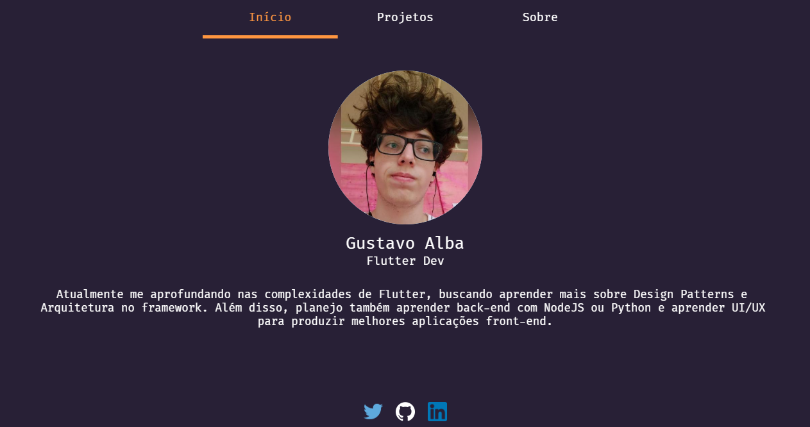
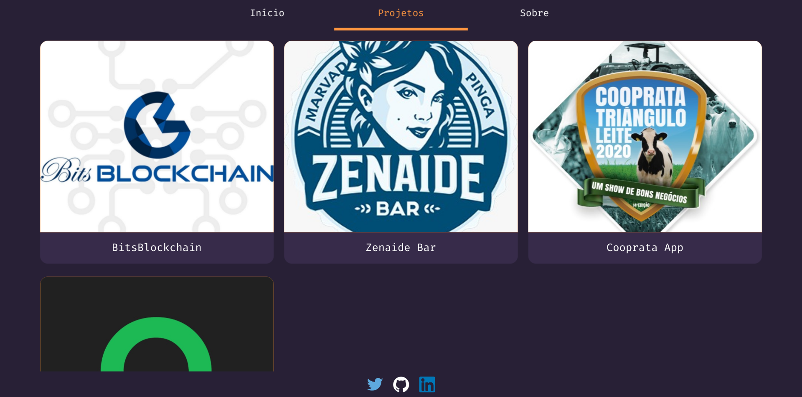
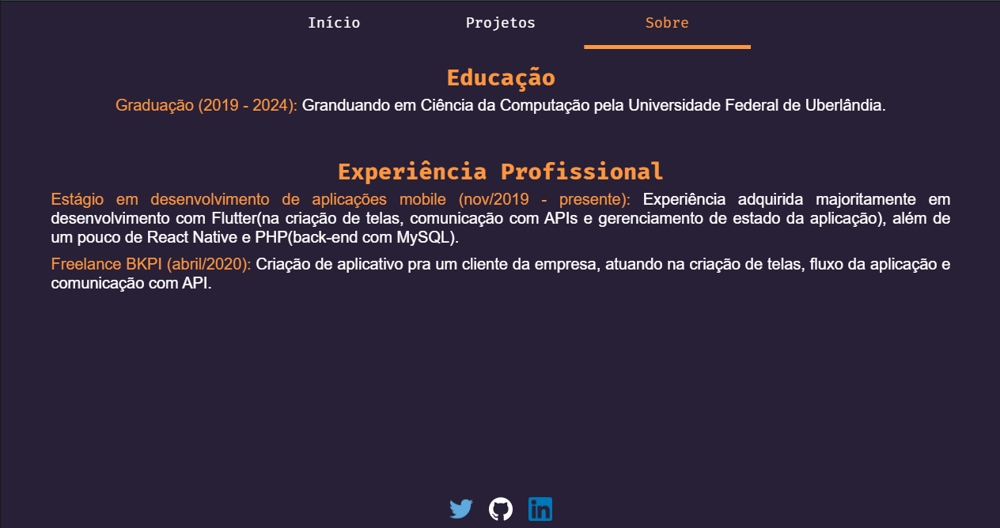

# Personal Website

This personal website was made entirely with Flutter Web.
In this repository you can found all Dart source code used.
Final result in: https://alba-22.github.io

This project features some basic stuff, with exhibition of some projects made and a bit of my experience.

#### Some Images

#### Used Plugins
- [AutoSizeText](https://pub.dev/packages/auto_size_text): helps with some responsiveness and layout by automatically resizing text
- [URL Launcher](https://pub.dev/packages/url_launcher): used to redirect user to other websites. In this case, to redirect user to Twitter, Github, LinkedIn or Google Play Store.